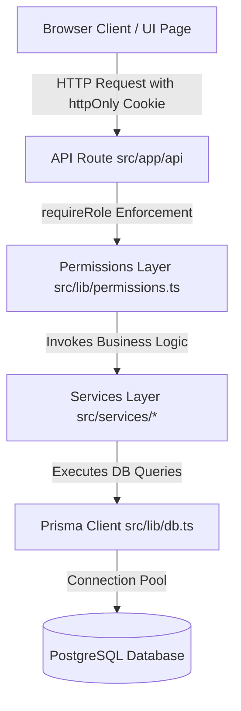

# Dogfood Hackathon Platform 🚀
> Open-source, 100% self-hostable hackathon submission and judging platform built for the 72h Among-Us Hackathon challenge.

[](file:///tests)
[](#tech-stack)
[](#hard-requirements)

---

## 📋 Table of Contents
1. [Architecture & Philosophy](#architecture--philosophy)
2. [Seeded Accounts & Demo Credentials](#seeded-accounts--demo-credentials)
3. [Quick Start (Docker & Local)](#quick-start)
4. [T1 Feature Implementation (Person B)](#t1-feature-implementation-person-b)
5. [Honest Tier Status](#honest-tier-status)
6. [API & Architecture Chain](#api--architecture-chain)
7. [Automated Test Suite](#automated-test-suite)

---

## 🏛️ Architecture & Philosophy

The Dogfood Hackathon Platform is engineered to run completely air-gapped without external cloud services, SaaS APIs, or third-party auth providers.



### Hard Requirements Enforced
- **Zero Cloud / Zero Network**: `docker compose up` starts a fully functional, seeded portal with no dependency on external auth, font CDNs, or cloud databases.
- **Custom Session Auth**: Secure password hashing with `bcryptjs` and session tokens stored in `httpOnly`, `SameSite=Lax` cookies.
- **Backend Role Authorization**: Enforced on the backend for every protected API route via `requireRole(['PARTICIPANT' | 'JUDGE' | 'ORGANIZER' | 'ADMIN'])`.
- **Offline Fonts & Styles**: Built with Tailwind CSS and standard system font stacks for complete air-gapped visual fidelity.

---

## 🔑 Seeded Accounts & Demo Credentials

When started via Docker or `npm run prisma:seed`, the database is populated with test users across all roles:

| Role | Email | Password | Assigned Context / Team |
| :--- | :--- | :--- | :--- |
| **ADMIN** | `admin@dogfood.test` | `Password123!` | System Administrator, unrestricted access |
| **ORGANIZER** | `organizer@dogfood.test` | `Password123!` | Sarah Organizer (Event settings, deadline management) |
| **JUDGE** | `judge1@dogfood.test` | `Password123!` | Dr. Evelyn Reed (Assigned to submissions 1 & 2) |
| **JUDGE** | `judge2@dogfood.test` | `Password123!` | Marcus Vance (Assigned to submission 1) |
| **PARTICIPANT** | `alice@dogfood.test` | `Password123!` | Alice Cooper (Team **The Impostors**, Code: `IMPOSTOR2026`) |
| **PARTICIPANT** | `bob@dogfood.test` | `Password123!` | Bob Martin (Teammate with Alice) |
| **PARTICIPANT** | `charlie@dogfood.test` | `Password123!` | Charlie Day (Team **Crewmates Collective**, Code: `CREWMATE2026`) |
| **PARTICIPANT** | `diana@dogfood.test` | `Password123!` | Diana Prince (Teammate with Charlie) |

> 💡 **Quick Login**: The `/login` page includes 1-click quick-fill buttons for all test roles to accelerate judging and demonstration.

---

## ⚡ Quick Start

### Option 1: Docker Compose (Recommended - Single Command)
Ensure Docker is installed and running:
```bash
docker compose up --build
```
This automatically boots PostgreSQL, applies schema migrations, seeds all sample data, and serves the portal at **http://localhost:3000**.

### Option 2: Local Development
```bash
# 1. Install dependencies
npm install

# 2. Configure environment variables (.env)
cp .env.example .env

# 3. Generate Prisma client & push schema
npx prisma generate
npx prisma db push

# 4. Seed database with demo accounts, events, teams, and submissions
npm run prisma:seed

# 5. Start development server
npm run dev
```

---

## 🎯 T1 Feature Implementation (Person B)

### 1. Events & Operations (`src/services/events.ts`)
- Organizer can create and edit events (name, description, startsAt, endsAt, submissionDeadline, status).
- Event status lifecycle: `UPCOMING` ➔ `ACTIVE` ➔ `VOTING` ➔ `CLOSED`.
- Support for multiple challenge tracks and tiered prize awards.
- `isSubmissionWindowOpen()` strictly checks date deadlines and prevents submissions to `CLOSED` events.

### 2. Teams & Invitations (`src/services/teams.ts`)
- Participants create teams and receive a shareable invite code (e.g., `IMPOSTOR2026`).
- Dedicated invite link landing page at `/join/[code]` displaying team roster and member count.
- **Team Size Limit**: Strictly caps squads at a **maximum of 4 members** (rejects with HTTP `409 Conflict`).
- **One Team per User**: Strictly prevents users from joining multiple teams in the same event (rejects with HTTP `409 Conflict`).

### 3. Submissions Lifecycle (`src/services/submissions.ts`)
- Teams can create submissions as `DRAFT` and iteratively refine title, description, track, repo URL, and live demo URL.
- Team members can toggle status between `DRAFT` and `SUBMITTED`.
- **Strict Deadline Enforcement**: The backend rejects any submission creation or editing attempts after the event deadline has passed (returns HTTP `403 Forbidden` with descriptive message).
- **Access Control**: Rejects edit attempts by non-team-members (returns HTTP `403 Forbidden`).

### 4. Public Project Gallery (`src/app/(public)/gallery`)
- Public showcase available without requiring authentication.
- **Hides Drafts**: Only projects with status `SUBMITTED` are visible in the gallery.
- Real-time client-side and server-side text search (matches title, description, team name) and track filtering pills.
- Dedicated detail page at `/gallery/[id]` highlighting full architecture breakdown, roster, repo, and demo links.

### 5. Organizer Dashboard (`src/app/(organizer)/organizer`)
- Real-time statistics: Registered teams, total projects, submitted projects, and draft count.
- Schedule & state controls: Adjust submission deadline on the fly or toggle event lifecycle stages.
- Submissions directory table listing tracks, teams, statuses, and repository links.

### 6. Shared Components & UX
- Dynamic navigation bar adapting in real-time to user role (`PARTICIPANT`, `JUDGE`, `ORGANIZER`, `ADMIN`, or Guest).
- Live countdown component (`EventCountdown.tsx`) with automatic transition to "Submissions Closed" state.
- One-click invite code copying (`CopyButton.tsx`).
- Styled category badges (`TrackBadge.tsx`).
- High-contrast, accessibility-checked dark mode with glassmorphic cards and subtle micro-animations.

---

## 📊 Honest Tier Status

| Tier | Component | Status | Details |
| :--- | :--- | :--- | :--- |
| **T1** | Custom Auth & Cookies | ✅ **100% COMPLETE** | Bcrypt password hashing, session tokens in `httpOnly` cookies, no SaaS. |
| **T1** | Backend RBAC | ✅ **100% COMPLETE** | `requireRole` strictly enforced on all API routes; `ADMIN` superuser override. |
| **T1** | Events (Dates, Tracks, Prizes) | ✅ **100% COMPLETE** | Full CRUD, track categorization, prize pools, deadline validation. |
| **T1** | Teams & Invite Links | ✅ **100% COMPLETE** | Unique codes, `/join/[code]` landing page, max 4 members limit, 1 team/event limit. |
| **T1** | Submissions & Deadline | ✅ **100% COMPLETE** | Draft/Submit states, non-member rejection (403), deadline enforcement (403). |
| **T1** | Public Gallery & Detail Pages | ✅ **100% COMPLETE** | `/gallery` search/filtering, drafts strictly hidden, `/gallery/[id]` detail view. |
| **T1** | Organizer Dashboard | ✅ **100% COMPLETE** | Metrics cards, deadline adjuster, status toggle, submission master table. |
| **T2** | Judging Models & Schema | 🟡 **FOUNDATION READY** | `Rubric`, `RubricCriterion`, `JudgeAssignment`, and `Score` models present in schema and seeded. Person C judging services, score normalization, and CSV exports to be plugged in. |
| **T3/T4** | Realtime WebSockets / Extensions | ⚪ **NOT STARTED** | Reserved for post-T2 judging completion. |

---

## 🧪 Automated Test Suite

We follow the principle: **"Correctness beats features. Do not claim anything that isn't tested."**

All business logic and security boundaries are covered by unit and integration tests running offline via Vitest:

```bash
npm test
```

### Verified Test Suites (18 Passed):
1. **Deadline Enforcement** (`tests/dogfood-t1-api.test.ts` & `tests/events.test.ts`):
   - Confirms backend rejects submission create/edit after `submissionDeadline` with HTTP `403`.
   - Confirms `isSubmissionWindowOpen` returns false for past deadlines or closed events.
2. **Team Size Limit** (`tests/dogfood-t1-api.test.ts`):
   - Confirms backend rejects 5th member joining a 4-member team with HTTP `409`.
   - Confirms backend rejects users attempting to join multiple teams in the same event with HTTP `409`.
3. **Non-Member Submission Control** (`tests/dogfood-t1-api.test.ts`):
   - Confirms non-team-members cannot create or edit submissions (HTTP `403`).
4. **Gallery Draft Filtering** (`tests/dogfood-t1-api.test.ts`):
   - Confirms public gallery query strictly includes only `SUBMITTED` projects and excludes `DRAFT` items.
5. **Team Invite Codes** (`tests/teams.test.ts`):
   - Verifies format, randomness, and uniqueness of generated team codes.
6. **Custom Auth & Permissions** (`tests/auth.test.ts` & `tests/permissions.test.ts`):
   - Verifies bcrypt hashing/comparison, session token generation, cookie extraction, and `AuthError` responses.

---

## 🔄 Definition of Done Verification Checklist

- [x] Participant can register an account with role `PARTICIPANT`.
- [x] Participant can create a team and copy an invite code / share invite link.
- [x] Teammate can visit `/join/[code]` and join the team (up to 4 members max).
- [x] Team member can draft a project submission (`status: DRAFT`).
- [x] Team member can finalize and submit project before deadline (`status: SUBMITTED`).
- [x] Backend blocks submission edits after the event deadline passes (HTTP 403).
- [x] Backend blocks non-team-members from altering submissions (HTTP 403).
- [x] Public visitors can view submitted projects on `/gallery` and inspect details on `/gallery/[id]` without logging in.
- [x] Draft projects are never exposed in the public gallery.
- [x] Organizer can monitor submissions, adjust deadlines, and toggle event status from `/organizer`.
